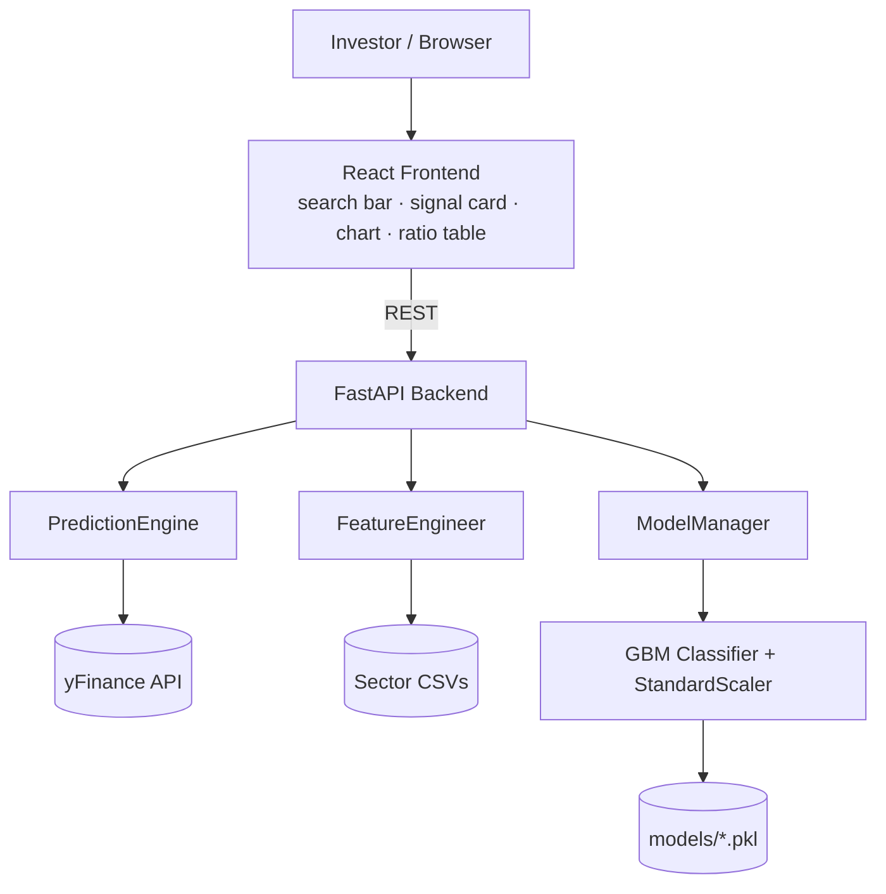

# 📈 Stock Appraisal

**An ML-powered stock screening tool for Indian equities.** Enter an NSE ticker and get a **BUY / HOLD / SELL** signal with a confidence score, served through a FastAPI backend and a React frontend.


> Capstone project, School of Computer Science Engineering and Technology, **Bennett University** (Team 411, Jan–Apr 2026). Mentor: Dr. Sonal Kukreja.

---

## 📌 Overview

Retail investors in India face thousands of listed stocks and often fall back on tips or herd behaviour. **Stock Appraisal** gives them a systematic first filter: a gradient-boosting model trained on quarterly price, momentum and volume features across **426 NSE/BSE stocks in 9 sectors**.

The system is designed as a **screening aid, not an oracle**. Running the model across all 426 tickers narrows the universe to a shortlist of roughly 50 candidates for further research.

## 🔑 Key Results

| Metric | Value |
|---|---|
| Stocks covered | 426 tickers, 9 sectors |
| Dataset | 15,730 quarterly records, 41 features |
| Hold-out test AUC (2024–2026) | **0.589** |
| Walk-forward mean AUC (5 market regimes) | **0.565** |
| Decision rule | BUY if p > 0.55, SELL if p < 0.45, otherwise HOLD |

**On the numbers:** an AUC of ~0.57–0.59 is a modest but real signal above random (0.5), which is typical for quarterly stock-direction prediction, where markets are close to efficient. The evaluation is deliberately strict (purged time split plus walk-forward validation, no look-ahead bias) so the figures reflect realistic conditions rather than inflated backtests.

## ✨ Features

- 🤖 **Gradient Boosting classifier** predicting forward price direction
- 🧪 **Leak-free evaluation**: purged time-based split and walk-forward cross-validation
- 🛠️ **Feature engineering**: momentum returns, volume anomalies, sector-relative metrics, RSI, drawdown
- 🌐 **Live data** via the `yfinance` API
- 🚀 **FastAPI backend** with auto-generated Swagger docs
- ⚛️ **React frontend** with a signal card, fundamentals table and price/momentum chart
- 🔄 **Batch predictions** for multiple tickers in one request
- 📊 **Model analytics** endpoint with metrics and feature importance

## 🏗️ Architecture



**Prediction flow:** ticker → fetch 5 years of quarterly data from yFinance → build features → scale → `predict_proba` → apply 0.55 / 0.45 thresholds → return signal, probability and confidence.

## 🧠 Methodology

### Data
- Source: `yfinance` (price, volume and quarterly financials), collected per ticker and merged by sector
- 9 sectors: Banking, Energy, Pharma, Healthcare, FMCG, Automobile, Infrastructure, Metals, Mining
- Label: `1` if the closing price 4 quarters ahead is higher than the current close, else `0`

### Features (41 total)
| Group | Examples |
|---|---|
| Momentum returns | `ret_2q`, `ret_4q`, `ret_8q` |
| Volume anomalies | `vol_ratio_8q`, `rel_vol_sector` |
| Technical | `RSI` (4-quarter window), `drawdown_8q`, `high_low_pct` |
| Fundamentals (auxiliary) | P/E, P/B, ROE, ROA, EPS, Debt/Equity |

> Fundamental ratios were not consistently reported across all 426 stocks over the full history, so the model relies mainly on price-return and volume features, with fundamentals used as auxiliary inputs. This matches the literature, where momentum and volume signals tend to dominate at quarterly frequency.

### Training and validation
| Split | Period |
|---|---|
| Train | Up to Sept 2022 |
| *(one-quarter purge gap)* | |
| Validation | 2023 |
| *(purge gap)* | |
| Test (hold-out) | 2024 – 2026 |

- **Model:** `GradientBoostingClassifier` (300 estimators, max depth 3, learning rate 0.03, subsample 0.8), a deliberately shallow configuration to limit overfitting
- **Scaling:** `StandardScaler` fitted on training data only
- **Validation:** purged time split plus walk-forward evaluation across five market regimes

## 🚀 Quick Start

### 1. Install dependencies
```bash
pip install -r requirements.txt
```

### 2. Start the API server
```bash
python run.py
```
The API runs at `http://localhost:8000`.

- Swagger UI: http://localhost:8000/docs
- ReDoc: http://localhost:8000/redoc

### 3. Make a prediction
```bash
curl "http://localhost:8000/predict/RELIANCE.NS"
```

```json
{
  "ticker": "RELIANCE.NS",
  "current_price": 2854.50,
  "previous_close": 2847.00,
  "price_change_pct": 0.26,
  "sector": "Energy",
  "prediction": "BUY",
  "confidence": 0.628,
  "recommendation": "Buy - Positive momentum expected",
  "timestamp": "2026-04-05T10:30:45.123456"
}
```

### Server options
```bash
python run.py --port 8001            # custom port
python run.py --reload               # auto-reload for development
python run.py --host 0.0.0.0 --port 8000
```

## 📋 API Endpoints

| Method | Endpoint | Description |
|---|---|---|
| `GET` | `/predict/{ticker}` | Signal (BUY / HOLD / SELL), price info and confidence for one ticker |
| `GET` | `/ticker-info/{ticker}` | Company details and market data |
| `GET` | `/model/stats` | Model metrics and feature importance |
| `POST` | `/batch-predict` | Predictions for multiple tickers, body: `{"tickers": ["RELIANCE.NS", "ITC.NS"]}` |

Full reference: [docs/README_API.md](docs/README_API.md)

### Python example
```python
import requests

# Single ticker
r = requests.get("http://localhost:8000/predict/RELIANCE.NS").json()
print(f"{r['ticker']}: {r['prediction']} (confidence {r['confidence']:.1%})")

# Batch
r = requests.post(
    "http://localhost:8000/batch-predict",
    json={"tickers": ["RELIANCE.NS", "ITC.NS", "SBIN.NS"]},
)
for p in r.json():
    print(p["ticker"], p["prediction"])
```

## 📊 Supported Sectors

| Sector | Sample tickers |
|---|---|
| Banking | `HDFCBANK.NS`, `ICICIBANK.NS`, `SBIN.NS` |
| Energy | `RELIANCE.NS`, `ONGC.NS`, `NTPC.NS`, `POWERGRID.NS` |
| Pharma | `CIPLA.NS`, `SUNPHARMA.NS`, `DIVISLAB.NS` |
| Healthcare | `APOLLOHOSP.NS`, `FORTIS.NS` |
| FMCG | `ITC.NS`, `NESTLEIND.NS`, `MARICO.NS` |
| Automobile | `MARUTI.NS`, `BAJAJ-AUTO.NS`, `EICHERMOT.NS` |
| Infrastructure | `ADANIPORTS.NS`, `LT.NS` |
| Metals | `TATASTEEL.NS`, `HINDALCO.NS`, `JSWSTEEL.NS` |
| Mining | `COALINDIA.NS`, `NMDC.NS`, `VEDL.NS` |

Tickers must include the `.NS` suffix. Stocks outside these sectors (e.g. IT services) are not part of the training data, so predictions for them are less reliable.

## 🗂️ Project Structure

```
Stock predictor/
├── README.md
├── run.py                  # Entry point (starts API server)
├── requirements.txt
│
├── src/
│   └── api_v2.py           # FastAPI application core
│
├── frontend/               # React app (signal card, chart, ratio table)
│
├── scripts/
│   ├── d1.py               # Data preprocessing / feature engineering
│   ├── d2.py               # Model training
│   ├── config.py           # Configuration
│   ├── client_examples.py  # Python usage examples
│   ├── verify_api.py       # API verification
│   └── api.py              # Previous API version
│
├── data/                   # Sector CSVs (Bank, Energy, Pharma, FMCG, Auto, Metal, Infra, Mine, Healthcare)
├── models/                 # Generated: stock_model.pkl, scaler.pkl, metadata.pkl
└── docs/                   # API reference, setup guide, architecture notes
```

## ⚠️ Limitations

- Predictive power is modest (test AUC 0.589); the tool is a **screening aid**, not a trading system
- Fundamental ratios are only auxiliary features due to inconsistent data coverage on yFinance
- Quarterly data means signals update slowly and cannot capture intraday or short-term moves
- No transaction costs, slippage or portfolio-level backtest are included
- The data pipeline and model retraining are run manually

## 🔭 Future Work

- Hyperparameter tuning of XGBoost with **Optuna** (early tests suggest a 1–2% AUC gain)
- Per-sector **LSTM** models to capture temporal structure within each ticker
- Scheduled quarterly data refresh and automatic retraining
- Portfolio-level backtesting with costs

## 🛠️ Tech Stack

**Backend:** Python, FastAPI, scikit-learn, XGBoost, pandas, NumPy, yfinance
**Frontend:** React, HTML, CSS
**Tooling:** Git, Jupyter, VS Code

## 👥 Team

| Name | Roll No. |
|---|---|
| Agrim Aggarwal | S24CSEU2304 |
| Harshit Dhaundiyal | S24CSEU2327 |
| Shivam Singh | S24CSEU2330 |

Mentor: Dr. Sonal Kukreja

## 🐛 Troubleshooting

- **Module not found:** run `pip install -r requirements.txt`
- **Port already in use:** `python run.py --port 8001`
- **API not responding:** confirm the server is running and open `/docs` to check
- **Invalid ticker:** include the `.NS` suffix and make sure the stock has enough quarterly history (at least 3 quarters)

## 🤝 Contributing

1. **Add a sector:** drop a CSV into `data/` and update `SECTOR_FILES` in `src/api_v2.py`
2. **Improve the model:** edit `scripts/d2.py` and retrain
3. **Add endpoints:** extend `src/api_v2.py`
4. **Update docs:** edit files in `docs/`

## ⚠️ Disclaimer

**This project is for educational purposes only and is not financial advice.**

- Predictions are based on historical data and statistical models
- Past performance does not guarantee future results
- Do not use this model for real trading without thorough backtesting
- The authors are not responsible for any financial losses
- Consult a qualified financial advisor before making investment decisions

## 📝 License

Provided as-is for educational and research purposes.

## 📚 References

- Fama (1970), *Efficient capital markets*
- Jegadeesh & Titman (1993), *Returns to buying winners and selling losers*
- Friedman (2001), *Greedy function approximation: a gradient boosting machine*
- Gu, Kelly & Xiu (2020), *Empirical asset pricing via machine learning*
- Lopez de Prado (2018), *Advances in Financial Machine Learning*
